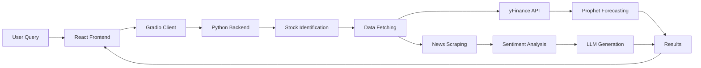

## Get Started in 5 Minutes

This guide will walk you through installing and making your first stock query with The Bounce Project.

<Note>
  **Prerequisites**: Ensure you have Node.js 18+, Python 3.12+, and pnpm installed on your system.
</Note>

<Steps>
  <Step title="Clone the Repository">
    First, clone The Bounce Project repository to your local machine:
    
    ```bash
    git clone https://github.com/vineetprash/byteClub_AB05.git
    cd byteClub_AB05
    ```
  </Step>

  <Step title="Install Dependencies">
    Install dependencies for both the client and server:
    
    <CodeGroup>
    ```bash Client (Frontend)
    cd client
    pnpm install
    ```
    
    ```bash Server (Backend)
    cd server
    pip install .
    ```
    </CodeGroup>
    
    <Info>
      The server installation will download several large AI models including the CardiffNLP sentiment model and Prophet dependencies. This may take a few minutes.
    </Info>
  </Step>

  <Step title="Start the Backend Server">
    Navigate to the server folder and start the Gradio API server:
    
    ```bash
    cd server/server
    python app.py
    ```
    
    You should see output indicating the Gradio server is running on `http://127.0.0.1:7860`:
    
    ```
    Running on local URL:  http://127.0.0.1:7860
    ```
    
    <Warning>
      Keep this terminal window open. The backend must be running for the frontend to communicate with the AI models.
    </Warning>
  </Step>

  <Step title="Start the Frontend">
    Open a new terminal window, navigate to the client folder, and start the development server:
    
    ```bash
    cd client
    pnpm run dev
    ```
    
    The Vite development server will start and display the local URL:
    
    ```
    VITE v5.1.6  ready in 423 ms
    
    ➜  Local:   http://localhost:5173/
    ➜  Network: use --host to expose
    ```
  </Step>

  <Step title="Make Your First Query">
    Open your browser to `http://localhost:5173`. You'll see the chat interface.
    
    Type a stock-related question in natural language, such as:
    
    <CodeGroup>
    ```text Example Query 1
    Should I invest in Apple?
    ```
    
    ```text Example Query 2
    Is Tesla stock going up?
    ```
    
    ```text Example Query 3
    Tell me about Microsoft stock performance
    ```
    </CodeGroup>
    
    Click the send button and wait for the AI to analyze the stock.
  </Step>

  <Step title="View Results">
    The system will display:
    
    1. **AI Recommendation**: Natural language response about whether to buy, hold, or sell
    2. **Stock Price Chart**: Historical data and 365-day future predictions
    3. **News Headlines**: Recent trending articles related to the stock
    
    <Tip>
      The analysis typically takes 10-30 seconds as the system fetches real-time data, analyzes sentiment, and generates predictions.
    </Tip>
  </Step>
</Steps>

## Understanding the Response

When you query a stock, The Bounce Project returns three types of information:

### 1. AI-Generated Recommendation

The chat interface displays a natural language response based on sentiment analysis:

<CodeGroup>
```text Positive Sentiment (Buy)
The stock [Name] has momentum. Recent trends suggest that the stock is going up and it is a good time to buy the stock and hold it for a while.
```

```text Neutral Sentiment (Hold)
The stock [Name] is stable currently. It won't have a lot of positive or negative fluctuations and you should hold it if you have it but no need to buy on priority.
```

```text Negative Sentiment (Sell)
The stock [Name] is not doing well. Recent trends suggest that the stock is going down and it is a good time to sell the stock and not buy it.
```
</CodeGroup>

### 2. Predictive Chart

An interactive Plotly chart showing:
- Historical stock prices from 2020-01-01 to 2024-03-01
- Prophet model predictions for the next 365 days
- Trend lines and confidence intervals

### 3. News Headlines

Recent headlines scraped from Business Today related to the queried stock, providing context for the recommendation.

## Architecture Overview

Here's how your query flows through the system:



## Common Issues

<AccordionGroup>
  <Accordion title="Connection refused at http://127.0.0.1:7860">
    This means the backend server isn't running. Make sure you've started `app.py` in the server directory and see the Gradio confirmation message.
  </Accordion>
  
  <Accordion title="Module not found errors">
    Ensure all dependencies are installed:
    ```bash
    # For client
    cd client && pnpm install
    
    # For server
    cd server && pip install .
    ```
  </Accordion>
  
  <Accordion title="Slow response times">
    The first query may be slow as models load into memory. Subsequent queries should be faster. The system:
    - Downloads stock data from Yahoo Finance
    - Scrapes and analyzes multiple news articles
    - Runs transformer models for sentiment analysis
    - Generates 365-day forecasts
  </Accordion>
  
  <Accordion title="API token errors">
    The backend uses EdenAI for text generation. The token in `app.py:13` may need to be updated if you encounter authentication errors.
  </Accordion>
</AccordionGroup>

## Next Steps

<CardGroup cols={2}>
  <Card title="Installation Guide" icon="download" href="/installation">
    Learn about detailed installation options and configuration
  </Card>
  
  <Card title="API Reference" icon="code" href="/api/overview">
    Explore the backend API endpoints and data structures
  </Card>
</CardGroup>

<Tip>
  Want to modify the prediction window? The forecast period is set in `server/app.py:124` with `make_forecast(model, 365)` where 365 is the number of days to predict.
</Tip>
